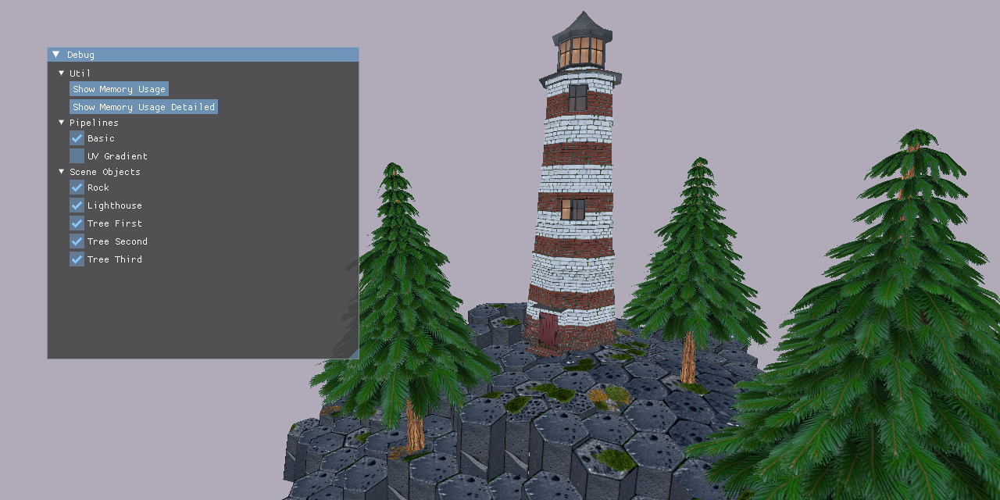

<p align="center">
    
</p>

# Vulkan SDL C++ Template

A clean boilerplate project to skip the initial ~1,000 lines of Vulkan setup and start working on graphics code immediately.

- Core stack: SDL3, VMA, Assimp, Dear ImGui, GLM, STB
- No fancy abstractions just a few reusable classes (Texture, Mesh, etc.)
- Minimal CMakeLists build file

Feel free to fork it, copy-paste the code and assets, or use them for any project you want.

## How To Build

### Prerequisites
- **CMake** 3.20 or higher
- **Vulkan SDK**
- A compiler with **C++23** support

### 1. Clone & Update Submodules
```bash
git clone https://github.com/brotherdimak/vulkan-sdl-cpp-template.git
cd vulkan-sdl-cpp-template
git submodule update --init --recursive --depth 1
```

### 2. Configure & Build
Open the project root folder directly in your preferred IDE, or build it via terminal:

```bash
# Configure the project
cmake -B build

# Build the project
cmake --build build --config Release
```

## License
This project is licensed under the MIT License.